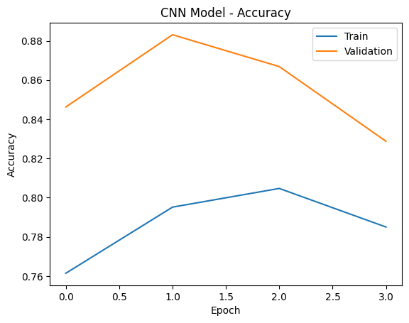
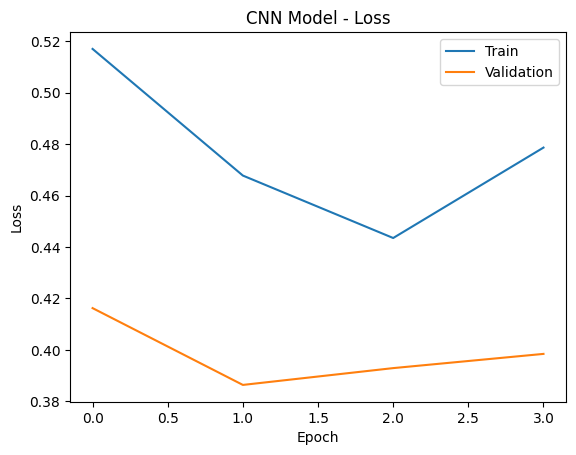
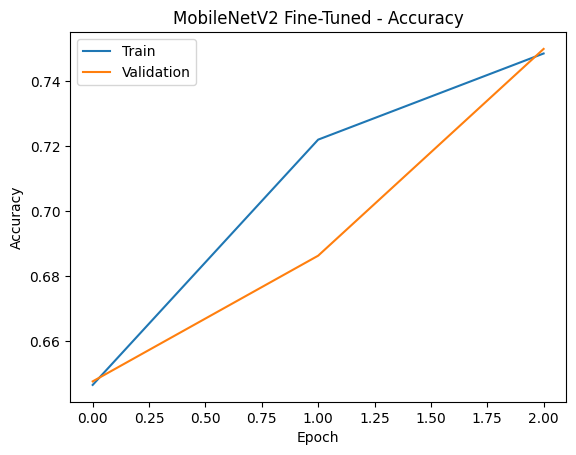
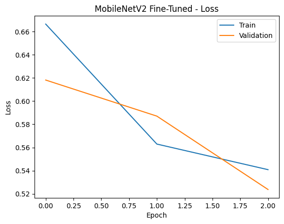

Breast Cancer Detection Using Deep Learning

Overview

This project focuses on the classification of breast histopathology images into Cancerous and Non-Cancerous categories using Deep Learning techniques. A Custom Convolutional Neural Network (CNN) and a Fine-Tuned MobileNetV2 model were developed and compared for breast cancer detection.

The project emphasizes the importance of recall in healthcare applications, where failing to detect cancer can have serious consequences.

---

Problem Statement

Breast cancer is one of the leading causes of cancer-related deaths among women worldwide. Histopathology image analysis is a critical step in diagnosis but requires significant time and expertise.

This project aims to automate the detection of cancerous tissue images using Deep Learning models to support medical professionals and improve early diagnosis.

---

Dataset

Dataset: Breast Histopathology Images (IDC)

Source:
https://www.kaggle.com/datasets/paultimothymooney/breast-histopathology-images

Original Dataset Size:
Approximately 277,000 histopathology image patches.

Classes:
• 0 – Non-Cancerous
• 1 – Cancerous

Challenge:
The original dataset is highly imbalanced and computationally expensive to train on directly.

---

Data Sampling and Balancing

To improve training efficiency and address class imbalance, a balanced subset was created:

• 12,000 Non-Cancer images
• 12,000 Cancer images

Benefits:

• Reduced training time
• Balanced class distribution
• Fair model learning
• Improved experimental consistency

Since the sampled dataset was balanced, class weights were not required during training.

---

Technologies Used

• Python
• TensorFlow
• Keras
• NumPy
• Matplotlib
• Scikit-Learn
• Pillow
• Google Colab

---

Project Workflow

1. Dataset Collection
2. Data Sampling and Balancing
3. Corrupted Image Removal
4. Image Resizing and Normalization
5. Data Augmentation
6. Training–Validation Split
7. CNN Model Training
8. MobileNetV2 Fine-Tuning
9. Prediction and Evaluation
10. Performance Comparison

---

Model 1: Custom CNN

Architecture:

• Conv2D (32 Filters) + MaxPooling
• Conv2D (64 Filters) + MaxPooling
• Conv2D (128 Filters) + MaxPooling
• Flatten Layer
• Dense Layer (128 Units)
• Dropout (0.5)
• Sigmoid Output Layer

Purpose:

The CNN model was developed as a baseline Deep Learning model to learn image features directly from the dataset.

---

Model 2: Fine-Tuned MobileNetV2

Architecture:

• Pretrained MobileNetV2
• ImageNet Weights
• Fine-Tuning of Final Layers
• Global Average Pooling
• Dense Layer
• Dropout Layer
• Sigmoid Output Layer

Key Features:

• Transfer Learning
• Low Learning Rate Training
• Efficient Feature Extraction
• Adapted for Medical Image Classification

MobileNetV2 contains approximately 2.2 million parameters and provides a lightweight yet powerful architecture.

---

Training Configuration

Optimizer:
Adam

Loss Function:
Binary Crossentropy

Batch Size:
32

Epochs:
5–6

Regularization:
Early Stopping

Image Size:
160 × 160

Data Augmentation:

• Rotation
• Zoom
• Horizontal Flip

---

Evaluation Metrics

The models were evaluated using:

• Accuracy
• Precision
• Recall
• F1-Score
• Confusion Matrix

Special emphasis was placed on Recall, as identifying cancer cases is more important than maximizing overall accuracy.

---

Results

Custom CNN

• Accuracy: ~87%
• Cancer Recall: ~90%

Observations:

• Strong baseline performance
• Good overall accuracy
• Missed some cancer cases

---

Fine-Tuned MobileNetV2

• Accuracy: ~76%
• Cancer Recall: ~98%

Observations:

• Significantly improved cancer detection
• Higher sensitivity to cancer cases
• Better suited for healthcare applications

---

Result Analysis

A trade-off was observed between Accuracy and Recall.

CNN:
• Higher overall accuracy
• Lower cancer detection rate

MobileNetV2:
• Lower overall accuracy
• Much higher cancer recall

In medical diagnosis systems, missing a cancer case is generally more dangerous than generating a false positive. Therefore, recall becomes a more important metric than accuracy.

Model Performance Visualizations

CNN Accuracy

CNN Loss

MobileNetV2 Accuracy

MobileNetV2 Loss

---

Key Insight

Accuracy alone can be misleading in healthcare applications.

A model with slightly lower accuracy but significantly higher recall is often preferred because it reduces the likelihood of missed cancer diagnoses.

---

Future Improvements

• ResNet50 Implementation
• EfficientNet Implementation
• Hyperparameter Optimization
• Explainable AI using Grad-CAM
• Flask-Based Deployment
• Web-Based Diagnostic Interface
